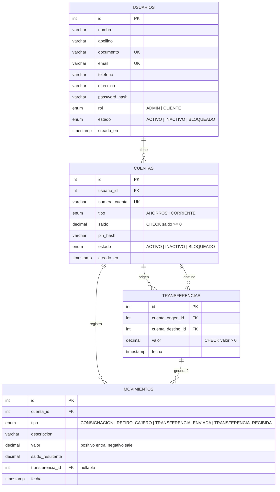

# Diagrama de la base de datos

> GitHub renderiza este diagrama automáticamente. También puedes pegarlo en https://mermaid.live para exportarlo como imagen (PNG/SVG) y entregarlo.

```mermaid
erDiagram
    USUARIOS ||--o{ CUENTAS : "tiene"
    CUENTAS ||--o{ MOVIMIENTOS : "registra"
    CUENTAS ||--o{ TRANSFERENCIAS : "origen"
    CUENTAS ||--o{ TRANSFERENCIAS : "destino"
    TRANSFERENCIAS ||--o{ MOVIMIENTOS : "genera 2"

    USUARIOS {
        int id PK
        varchar nombre
        varchar apellido
        varchar documento UK
        varchar email UK
        varchar telefono
        varchar direccion
        varchar password_hash
        enum rol "ADMIN | CLIENTE"
        enum estado "ACTIVO | INACTIVO | BLOQUEADO"
        timestamp creado_en
    }
    CUENTAS {
        int id PK
        int usuario_id FK
        varchar numero_cuenta UK
        enum tipo "AHORROS | CORRIENTE"
        decimal saldo "CHECK saldo >= 0"
        varchar pin_hash
        enum estado "ACTIVO | INACTIVO | BLOQUEADO"
        timestamp creado_en
    }
    TRANSFERENCIAS {
        int id PK
        int cuenta_origen_id FK
        int cuenta_destino_id FK
        decimal valor "CHECK valor > 0"
        timestamp fecha
    }
    MOVIMIENTOS {
        int id PK
        int cuenta_id FK
        enum tipo "CONSIGNACION | RETIRO_CAJERO | TRANSFERENCIA_ENVIADA | TRANSFERENCIA_RECIBIDA"
        varchar descripcion
        decimal valor "positivo entra, negativo sale"
        decimal saldo_resultante
        int transferencia_id FK "nullable"
        timestamp fecha
    }
```
